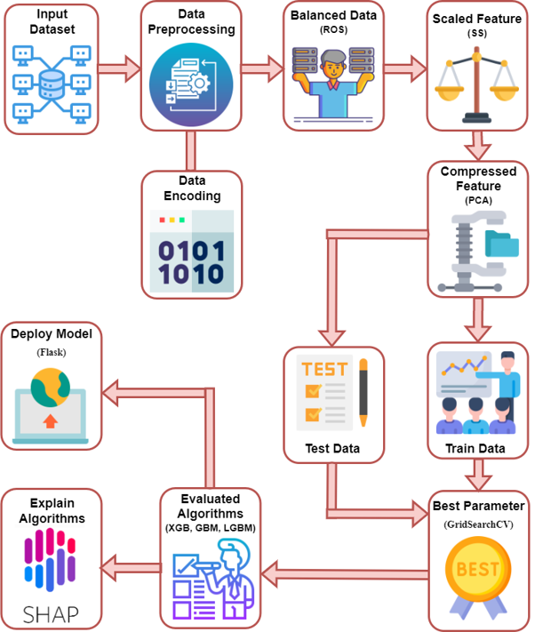

# Lung_Cancer_Prediction
This repository presents a machine learning-based framework for predicting lung cancer using patient clinical and behavioral information. The project investigates multiple supervised learning algorithms and evaluates their effectiveness in identifying individuals at risk of lung cancer. The framework emphasizes reproducibility, model comparison, and interpretability to support healthcare decision-making.
## Project Objectives

- Develop an accurate lung cancer prediction model.
- Compare the performance of multiple machine learning algorithms.
- Perform comprehensive data preprocessing and feature engineering.
- Optimize model performance using hyperparameter tuning.
- Evaluate models using standard classification metrics.
- Improve model interpretability through explainable AI techniques.
## Proposed Methodology

The proposed lung cancer prediction framework consists of two major components: an overall system architecture and a detailed processing workflow. The overview illustrates the complete prediction pipeline, while the workflow demonstrates each processing stage from data acquisition to model evaluation.

### Framework Overview

  

<b>Figure 1.</b> Overall architecture of the proposed methodology.

---

### Processing Workflow

  

<b>Figure 2.</b> Detailed workflow of the proposed methodology

